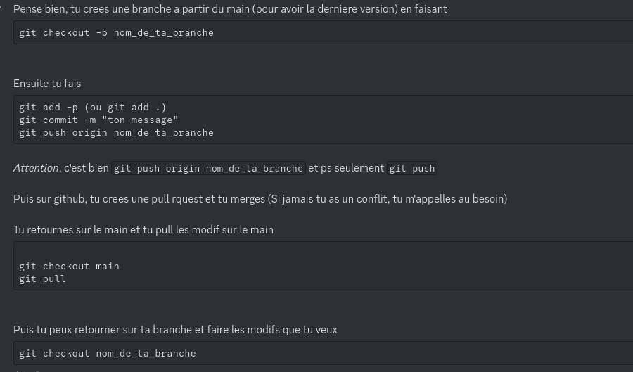
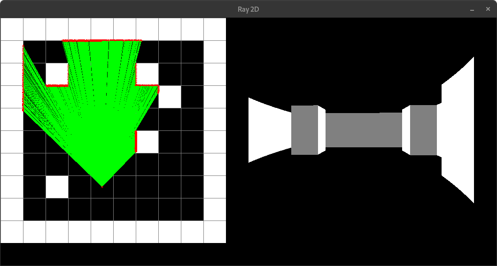
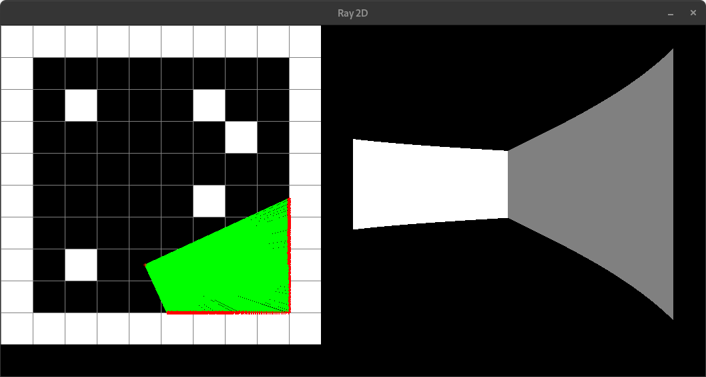
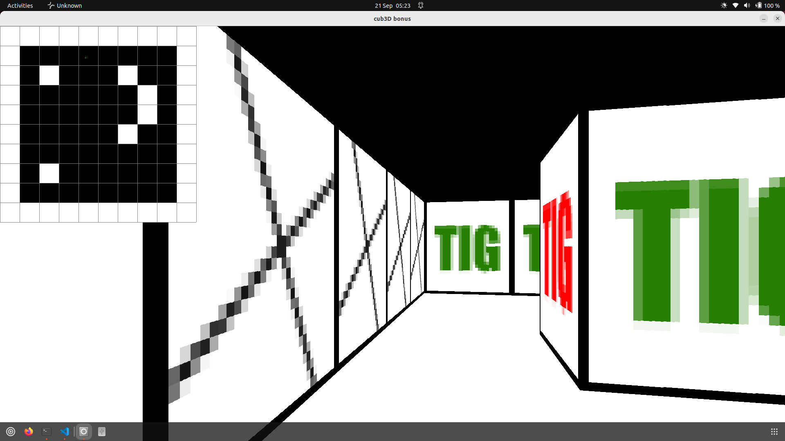
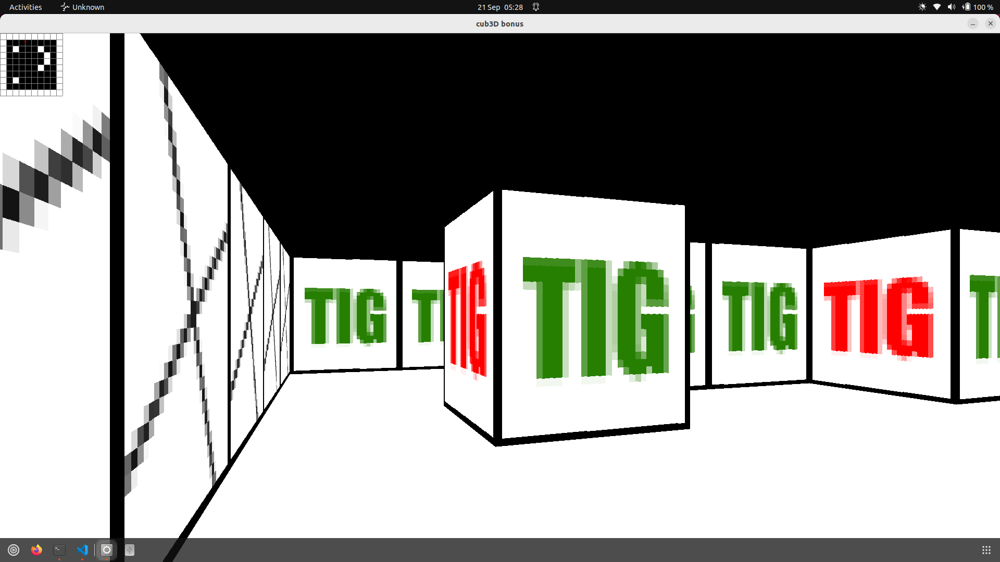
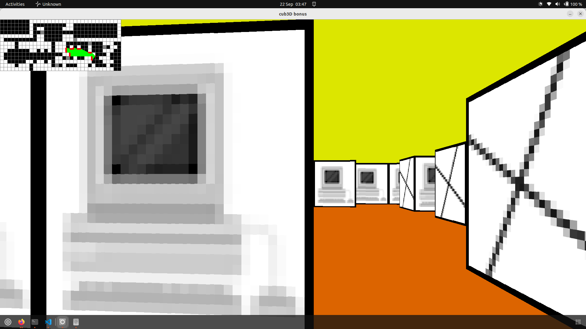
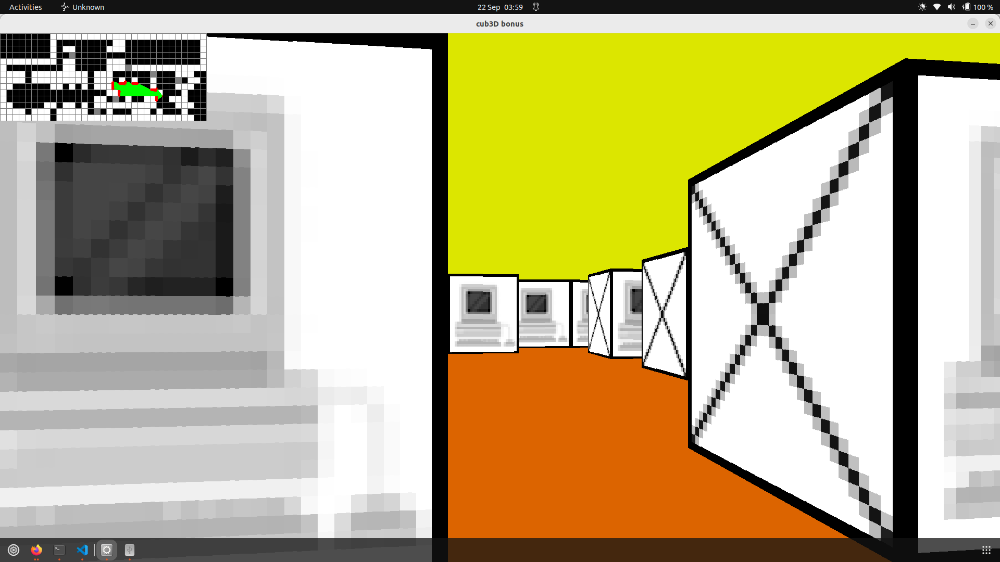

15.08 - Elsa
Mettre les variables a NULL apres les avoir free evite les bugs. Meme si un pointeur est free, on n'a aucune garantie que sa memoire ne soit pas de nouveau allouee, ce qui peut occasionner des leaks ou des segfaults.
J'ai eu ce probleme sur push_swap et on l'a eu sur minishell, on mettant le pointeur a NULL apres un free(), on n'avait plus de probleme.
Si tu veux plus de details (et certainement de meilleures exxplications) : https://stackoverflow.com/questions/1025589/setting-variable-to-null-after-free
Et : https://wiki.sei.cmu.edu/confluence/pages/viewpage.action?pageId=87152148#:~:text=Setting%20message%20to%20NULL%20after,same%20memory%20more%20than%20once.

---

16.08 - Elsa
Objectif :
Si tu regardes les 2 maps maps/bad/texture_doublon_c.cub et maps/bad/texture_doublon_f.cub
la difference est la place du doublon.
Dans texture_doublon_f.cub,	on n'a pas encore set toutes les textures avant d'arriver sur le doublon, donc on a bien un message d'erreur.
Dans texture_doublon_c.cub, on a DEJA set toutes les textures avant d'arriver sur le doublon, donc on N'A PAS de message d'erreur.
L'idee est donc d'avoir un enum qui check l'etat du parsing.
Tant que l'enum est a SETTING,
	on check les values et on les set. Une fois qu'elles sont toutes set,
	on change l'etat pour le mettre a MAP et la on parse la map en skippant les premieres 
	de gnl qu'on a deja lu.
	A ce moment la, on check la map, si jamais on ne tombe pas sur un '\n' ou un 1,
	c'est que la map n'est pas bonne et on renvoie le message d'erreur approprie.
Si on ne trouve pas d'erreur, on parse la map, quand gnl est fini,
	on change le state a END puisqu'on est arrive a la fin du fichier

---

16.08 - Cedric
Quand GNL renvoie NULL, ca veut dire que soit on est apres la derniere ligne, soit il y a eu un pb au cours de GNL.  

--> Ces 2 cas au lieu de 1, ca pose vraiment probleme, pour les differencier proprement il faudrait recoder GNL.
Donc je te propose d'adopter une norme : si GNL renvoie NULL, c'est qu'on est a la fin.
Si en fait c'etait un pb system, alors a mon avis il va y avoir bien d'autres pb dans le fonctionnemt de cub3D sur l'ordi.

---

16.08 - Cedric
Une scene, c'est :
- soit une ligne vide
- soit une ligne de data
- soit une lgne de map
Une ligne vide  = 32 ou 9/13, ou 0 (et pas autre chose)
une ligne de map = 1 ou 0 ou N/S/W/E (et pas autre chose)
- ligne de map valide si 1 au moins 2 fois et 1 seul des N/S/W/E (la map globale peut toujours ne pas etre valide)
Une ligne de data  = spacesNO/SO/WE/EA/F/C(can be space)next (et pas autre chose sauf dans le next)

---

17.08 - Cedric
Pourquoi pas de tab dans la map ? moi ca me va
Chercher un script pour tester les maps
putstr_fd(EOPN, 2) --> perror("cub3D") ??
putstr_fd(EGAL, 2) --> perror("cub3D") ??
ft_atoi_cub : j'ai envie de prendre +255 ou +0 comme couleur valide

--- 

17.08 - Cedric
Beaucoup de modifications mais rien de nouveau :
- corriger toutes mes erreurs until next one
- reprise de toutes les bonnes idees, et clarifier/simplifier le code
Amelioration de ft_atoi_cub en cours --> NON TERMINE

--- 

18.08 - Cedric
ft_atoi_cub improved --> too much?
parse_data_line improved for colors --> too much?
Colors inside data already checked (by get_data and so on), so it remains only path to be checked
No need to init colors at -1, error msg should deal with issues re colors
Format path to valid = SpacesPATH.xpmSpaces\n
check_path in progress
check_map on draft

--- 

27.08 - Elsa - git tuto

31.08 - Cedric - image with mlx
https://gontjarow.github.io/MiniLibX/mlx-tutorial-create-image.html

Le probleme

Angle droit issue :

through wall isse tile 12 step 6

